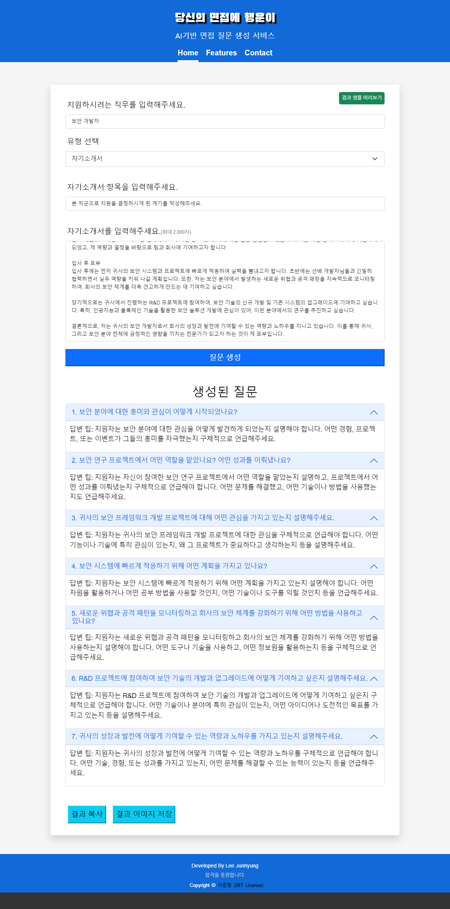

서비스 종료

[![Contributors][contributors-shield]][contributors-url]
[![Forks][forks-shield]][forks-url]
[![Stargazers][stars-shield]][stars-url]
[![Issues][issues-shield]][issues-url]
[![MIT License][license-shield]][license-url]

<!-- PROJECT LOGO -->
 

  

  <h3 align="center">당면행은 "당신의 면접에 행운이"의 줄임말로,  직무, 자기소개서 항목, 자기소개서 내용을 분석하여 면접 질문 및 질문 의도를 생성합니다.</h3>

---

---
### 특징

1. Openai API의 GPT3.5-Turbo 모델을 활용하였습니다.
2. 입력하신 내용을 최대한 꼼꼼하게 검토하여 면접 질문을 생성하도록 최적화 되어있습니다.
3. 자기소개서 데이터는 수집하지 않고 있습니다.
4. "직무" 입력란은 100자를 초과하여 입력할 수 없도록 설계되어 있습니다.
5. "자기소개서 항목", "프로젝트 제목" 입력란은 300자를 초과하여 입력할 수 없도록 설계되어 있습니다.
6. "자기소개서 내용", "프로젝트 내용" 입력란은 2000자를 초과하여 입력할 수 없도록 설계되어 있습니다.

---
### 개발
-  BE: Flask Framework
-  FE1: Jinja2 Template Engine
-  FE2: HTML & CSS(Bootstrap 5.0 + custom style)
-  FE3: Javascript(jQuery 3.2.1)
-  API: Openai API
-  Model: GPT3.5-Turbo
-  SSL: Openssl & Let's encrypt
-  Flatform: Google Cloude Flatform
-  Server: Ubuntu:20.04
-  Sub-System: Docker
-  Middleware: Apache2
-  Python Version: 3.10.13

---
### 업데이트
V1.1(Beta). 2023.08.30 배포 완료: 자기소개서 기반 면접 질문 생성 기능 추가   
V1.2(Beta). 업데이트 예정   

---
### 개선 예정
1. Fine Turning   
  1.1. 자기소개서 & 면접 질문 데이터셋을 통해 튜닝 예정   
  1.2. 자기소개서 항목 의도 파악 등 실제 면접 질문으로 나올 가능성이 높은 데이터를 추출할 수 있도록 튜닝 예정   
2. 회원가입 및 면접 질문 관리 기능   
  2.1. 목적: 사용자가 직접 생성된 면접 질문 중 가능성이 높아 보이는 것을 지정하여 관리할 수 있도록 함.   
  2.2. 가능성: 사용자의 자기소개서 항목이 DB에 저장되어야 함. 하지만, 자기소개서는 개인정보로 분류될 수 있으므로 개인정보 처리방침 및 사업자 등록이 필요할 수 있음. 따라서 실현 가능성이 낮지만, 사용자의 요구가 많다면 적극 반영할 예정임.   

---
### 피드백 및 컨택
서비스 사용 중 불편한 점이나, 개선사항 등 피드백은 언제나 환영입니다.
1. Email(권장): Weakness@kakao.com
2. Issue(권장): [Github Issue](https://github.com/with-developer/Interview-Question-Generator/issues)
3. Form: [Google Form](https://forms.gle/EhH886FNS8VhGi2a9)

<!-- MARKDOWN LINKS & IMAGES -->
<!-- https://www.markdownguide.org/basic-syntax/#reference-style-links -->
[contributors-shield]: https://img.shields.io/github/contributors/with-developer/Interview-Question-Generator.svg
[contributors-url]: https://github.com/with-developer/Interview-Question-Generator/graphs/contributors
[forks-shield]: https://img.shields.io/github/forks/with-developer/Interview-Question-Generatore.svg
[forks-url]: https://github.com/with-developer/Interview-Question-Generator/network/members
[stars-shield]: https://img.shields.io/github/stars/with-developer/Interview-Question-Generator.svg
[stars-url]: https://github.com/with-developer/Interview-Question-Generator/stargazers
[issues-shield]: https://img.shields.io/github/issues/with-developer/Interview-Question-Generator.svg
[issues-url]: https://github.com/with-developer/Interview-Question-Generator/issues
[license-shield]: https://img.shields.io/github/license/with-developer/Interview-Question-Generator.svg
[license-url]: https://github.com/with-developer/Interview-Question-Generator/blob/main/LICENSE
